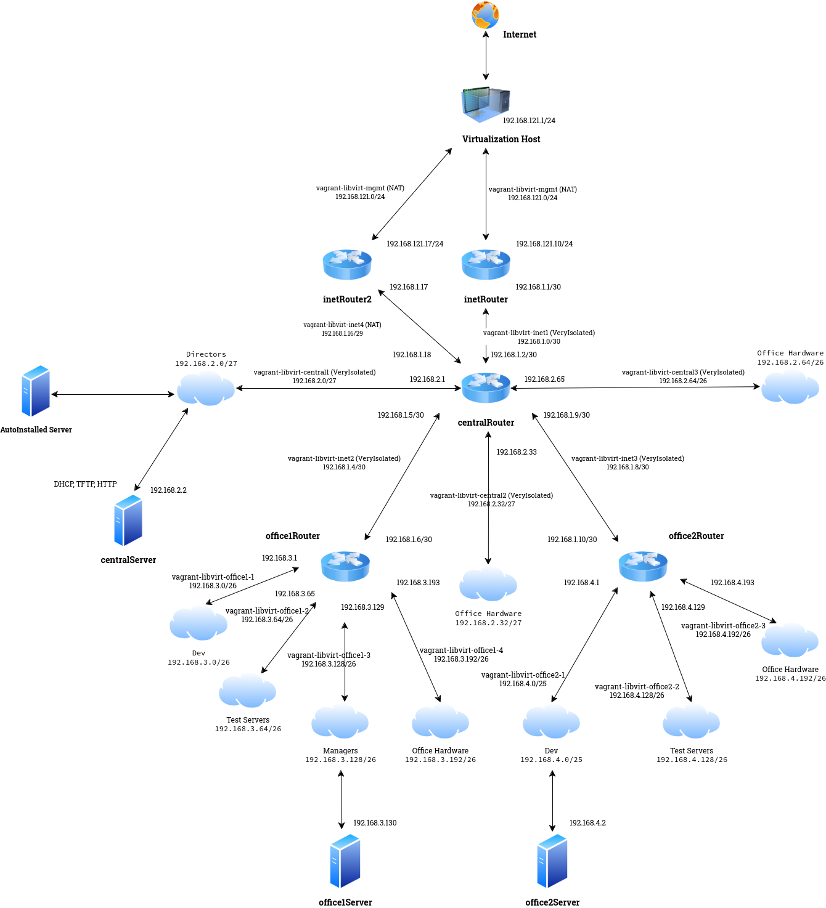
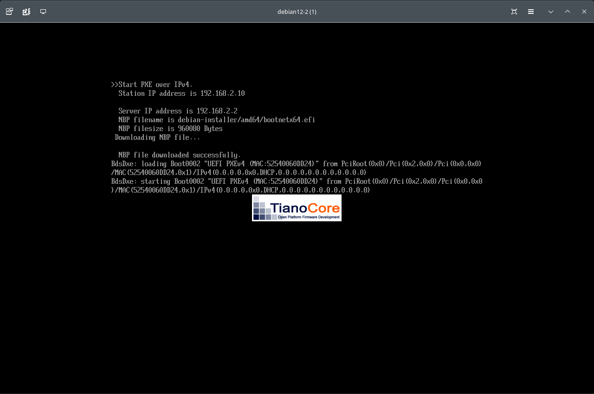
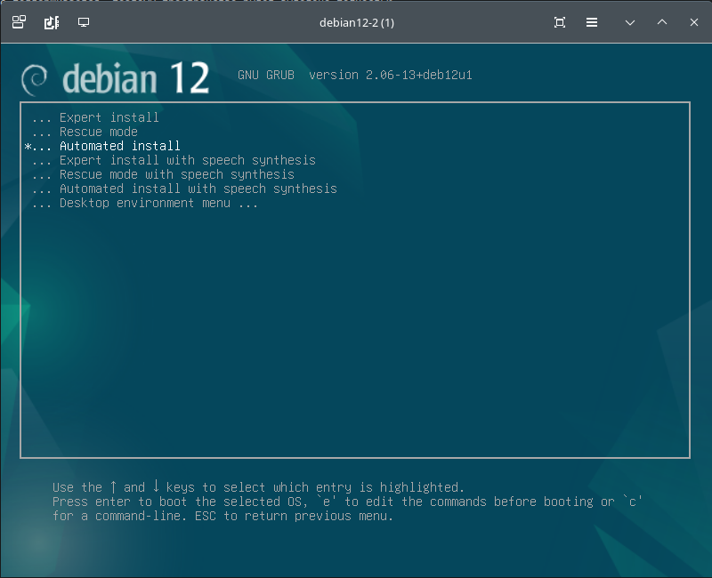
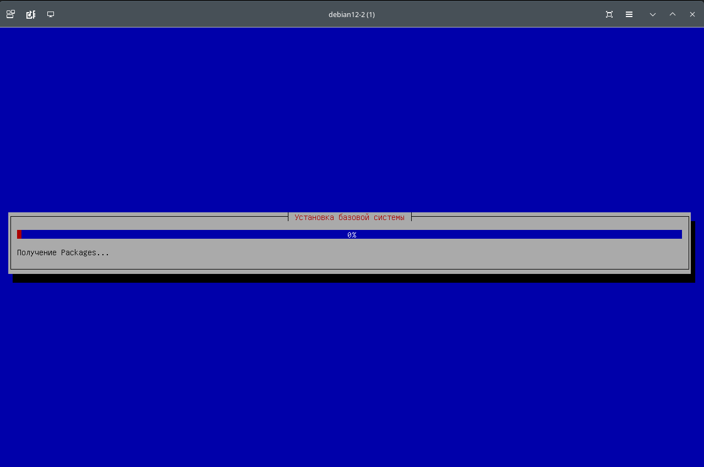

#### Настройка автоматической установки Debian Linux при помощи DHCP, TFTP и PXE на примере дистрибутива Debian Bookworm

> [!NOTE]
> DHCP - протокол управления сетью , используемый в сетях Интернет-протокола (IP) для автоматического назначения IP-адресов и других параметров связи устройствам, подключенным к сети с использованием архитектуры клиент-сервер .

> [!NOTE]
> TFTP - (англ. Trivial File Transfer Protocol — простой протокол передачи файлов) используется главным образом для первоначальной загрузки бездисковых рабочих станций. TFTP, в отличие от FTP, не содержит возможностей аутентификации (хотя возможна фильтрация по IP-адресу) и основан на транспортном протоколе UDP.

> [!NOTE]
> PXE (англ.Preboot eXecution Environment) — среда для загрузки компьютеров с помощью сетевой карты без использования жестких дисков, компакт-дисков и других подобных устройств. Частным случаем автоматической загрузки является установка ОС по сети.

Для настройки загрузки машин с помощью сетевой карты и дальнейшей автоматической установки операционной системы будем использовать стенд с виртуальной моделью офисной сети, 
который использовался в предыдущих работах - [Архитектура сетей](https://github.com/spanishairman/networksdebian) и [Настройка базовых правил фильтрации сетевых пакетов](https://github.com/spanishairman/iptables-debian).
Схема офисной сети:


Здесь мы добавили виртуальный хост _AutoInstalled Server_ в сеть _vagrant-libvirt-central1 (VeryIsolated) 192.168.2.0/27_, а на виртуальной машине _centralServer_ создали службы _DHCP_, _TFTP_ и _HTTP_. 

> [!IMPORTANT]
> Так как _Vagrant_ выполняет параллельный запуск всех серверов, описанных в [Vagrantfile](Vagrantfile), то загрузка любого из них с помощью _PXE_ по сети затруднительна из-за того, что необходимые для этого службы еще не работают. В связи с этим, 
> для запуска виртуальной машины _AutoInstalled Server_ __после завершения рзворачивания офисной сети__ из [Vagrantfile](Vagrantfile), будет использоваться _Virsh_ - утилита для командной строки Linux, предназначенная для управления виртуальными машинами 
> и гипервизорами KVM и Xen.

Скрипт запуска виртуальной машины (прилагается):
```
#!/bin/bash
virt-install \
        --connect qemu:///system \
        --pxe \
        --osinfo debian12 \
        --name  debian12-2 \
        --boot uefi \
        --vcpus 8 \
        --memory 1024 \
        --disk size=20,pool=pool \
        --network network=vagrant-libvirt-central1,model=virtio,driver.iommu=on \
        --graphics spice \
```
Здесь для разворачивания хоста заданы следующие параметры:
  - __pxe__ - для загрузки машины по сети;
  - __boot uefi__ - _Unified Extensible Firmware Interface_ (__UEFI__) - прошивка виртуального оборудования создаваемого хоста;
  - __disk__ - дисковое устройство, используемое в создаваемой машине. В данном случае, это том _LVM_ в группе томов _pool_, размером 20Гб/. Имя тома совпадает с именем виртуальной машины;
  - __network network__ - виртуальная сеть, к которой будет подключен сетевой адаптер, в днном случае, это изолированная сеть _vagrant-libvirt-central1_
  - __graphics__  протокол для подключения к графической оболочке машины. В нашем случае _spice_.

##### DHCP
После включения, виртуальная машина должна получить сетевой адрес и параметры, необходимые для получения загрузчива, для этого требуется настройка DHCP-сервера. В нашем случае, мы будем использовать _isc-dhcp-server_ со следующими настройками:
```
option domain-name "local";
option domain-name-servers 8.8.8.8;

default-lease-time 600;
max-lease-time 7200;

ddns-update-style none;

next-server 192.168.2.2;
option architecture code 93 = unsigned integer 16 ;
# Опция архитектуры 0x0007 - загрузка EFI
# Опция архитекторы 0x0000 - традиционная загрузка
  if option architecture = 00:07 {
    filename "debian-installer/amd64/bootnetx64.efi";
} elsif option architecture = 00:00 {
  filename "pxelinux.0";
      }

subnet 192.168.2.0 netmask 255.255.255.224 {
range 192.168.2.10 192.168.2.15;
option broadcast-address 192.168.2.31;
option routers 192.168.2.1;
if substring (option vendor-class-identifier, 0, 3) = "d-i" {
    filename "http://192.168.2.2/preseed.cfg";
}
}
```
Здесь при описании _TFTP_-сервера (блок параметров для _next-server_) в зависимости от прошивки _DHCP_-клиента - _BIOS_ или _UEFI_ для загрузки будет предлагаться файл _pxelinux.0_ или _bootnetx64.efi_, соответственно. Описание кодов расширения DHCP для PXE (RFC-4578)
можно найти [здесь](http://www.bog.pp.ru/work/PXE.html). В частности, нас интересует:
```
93. список допустимых системных архитектур клиента (2 байта)
  - 0 - Intel x86 PC (наш любимый BIOS)
  - 1 - NEC PC98
  - 2 - EFI Itanium IA64
  - 3 - DEC Alpha
  - 4 - Arc x86
  - 5 - Intel Lean System
  - 6 - EFI IA32
  - 7 - EFI BC (EBC, EFI Byte Code - код виртуальной машины; ошибка в RFC и так отзывается UEFI для X86-64)
  - 8 - EFI Xscale
  - 9 - EFI x86-64 (ошибка в RFC и так отзывается EFI BC)
  - 15 - Intel x86 UEFI, загрузка по HTTP
  - 16 - Intel x86-64 UEFI, загрузка по HTTP
```

Блок настроек:
```
if substring (option vendor-class-identifier, 0, 3) = "d-i" {
    filename "http://192.168.2.2/preseed.cfg";
}
```
указывает DHCP-клиентам, которые идентифицируются как _Debian Installer_ расположение файла с предопределёнными параметрами для автоматической установки операционной системы. Это будет рассмотрено далее.

> [!IMPORTANT]
> Обратите внимание на опцию _domain-name-servers_ - здесь мы указываем общедоступный сервер имен виесто стандартной настройки, которая указывает на ip-адрес сетевого интерфейса хостовой машины.
> Эта настройка необходима, так как для запуска машины с сетевой загрузкой мы используем только один сетевой адаптер, который не подключен к хосту интерфейсом _mgmt_.

##### TFTP
Параметры для демона _TFTP_ располагаются в файле _/etc/default/tftpd-hpa_. Здесь нам не придётся ничего менять, единственный интересующий нас парамеьтр, это каталог для размещаемых файлов:
```
# /etc/default/tftpd-hpa

TFTP_USERNAME="tftp"
TFTP_DIRECTORY="/srv/tftp"
TFTP_ADDRESS=":69"
TFTP_OPTIONS="--secure"
```
Для возможности загрузки клиентов потребуется скачать и распаковать загрузочный образ [отсюда](https://www.debian.org/distrib/netinst#netboot). См. раздел __Set up TFTP server__ на странице [документации](https://wiki.debian.org/PXEBootInstall#Set_up_TFTP_server).

За это действие отвечает блок настроек из [Vagrantfile](Vagrantfile):
```
wget --directory-prefix=/home/vagrant/ https://deb.debian.org/debian/dists/bookworm/main/installer-amd64/current/images/netboot/netboot.tar.gz
tar -xzvf /home/vagrant/netboot.tar.gz -C /srv/tftp
```
##### Автоматическая установка. Файл _preseed.cfg_
__Preseeding__ позволяет задать ответы на вопросы, задаваемые в процессе установки, без необходимости вручную вводить ответы во время выполнения установки. 

Это позволяет полностью автоматизировать большинство типов установки и даже предлагает некоторые функции, недоступные во время обычных установок.

Для Debian Bookworm существует пример стандартного файла _preseed.cfg_, который можно загрузить [отсюда](https://www.debian.org/releases/bookworm/example-preseed.txt). Также файл с параметрами установки можно создать с помощью
утилиты _debconf-utils_. Следующие команды позволяют:
  - Получить текущие настройки debconf для DebianInstaller: `debconf-get-selections --installer`;
  - получить текущие настройки debconf для установленных пакетов: `debconf-get-selections`.

Для сохранения параметров установки и получения готового файла автоматической установки, потребуется на установленной вручную системе выполнить команды:
```
echo '#_preseed_V1' > preseed.cfg
debconf-get-selections --installer >> preseed.cfg
debconf-get-selections
```
> [!IMPORTANT] 
> Скопируйте все соответствующие значения из вывода этих команд и добавьте их в свой пользовательский файл preseed.cfg . Не работайте с файлом preseed.cfg, сгенерированным `debconf-get-selections --installer`, 
> а извлеките из него значения и измените ими пример файла preseed.

В данной работе я установил вручную Debian Bookworm на виртуальной машине, сохранил параметры установки в файл и отредактировал в соответствии со своими потребностями скачанный ранее стандартный _preseed.cfg_ для _Debian Bookworm_.

> [!NOTE]
> Пароли учётных записей в файле _preseed.cfg_ можно хранить как в виде открытого текста, так и зашифрованом виде с использованием хэша _crypt_. Чтобы получить зашифрованный хэш, используйте команду `mkpasswd -m sha-512` из набора утилит _whois_.
> Таким образом, строка с зашифрованным паролем пользователя _root_ примет вид `d-i passwd/root-password-crypted password $6$bYRYbRhhjhUczn4J$p3gjHQ2OQItPaQMMzkU12tsXH83BJlJG8Gk3GMGMz4It5s4TeuNwQXPyoj3fz6FbVPpp2K8CdluLQsElpxIig/`

После выполнения всех настроек блок [Vagrantfile](Vagrantfile), отвечющий за виртуальную машины _centralServer_ выглядит следующим образом:
```
  config.vm.define "Debian12-centralServer" do |centralserver|
  centralserver.vm.box = "/home/max/vagrant/images/debian12"
  centralserver.vm.network :private_network,
       :type => 'ip',
       :libvirt__forward_mode => 'veryisolated',
       :libvirt__dhcp_enabled => false,
       :ip => '192.168.2.2',
       :libvirt__netmask => '255.255.255.224',
       :libvirt__network_name => 'vagrant-libvirt-central1',
       :libvirt__always_destroy => false
  centralserver.vm.provider "libvirt" do |lvirt|
      lvirt.memory = "1024"
      lvirt.cpus = "1"
      lvirt.title = "Debian12-centralServer"
      lvirt.description = "Виртуальная машина на базе дистрибутива Debian Linux. centralServer"
      lvirt.management_network_name = "vagrant-libvirt-mgmt"
      lvirt.management_network_address = "192.168.121.0/24"
      lvirt.management_network_keep = "true"
      lvirt.management_network_mac = "52:54:00:27:28:89"
  #   lv.storage :file, :size => '1G', :device => 'vdb', :allow_existing => false
  end
  centralserver.vm.provision "file", source: "dhcp/dhcpd.conf", destination: "~/dhcpd.conf"
  centralserver.vm.provision "file", source: "dhcp/isc-dhcp-server", destination: "~/isc-dhcp-server"
  centralserver.vm.provision "file", source: "dhcp/preseed.cfg", destination: "~/preseed.cfg"
  centralserver.vm.provision "shell", inline: <<-SHELL
      brd='*************************************************************'
      echo "$brd"
      echo 'Set Hostname'
      hostnamectl set-hostname centralserver
      echo "$brd"
      sed -i 's/debian12/centralserver/' /etc/hosts
      sed -i 's/debian12/centralserver/' /etc/hosts
      echo "$brd"
      echo 'Изменим ttl для работы через раздающий телефон'
      echo "$brd"
      sysctl -w net.ipv4.ip_default_ttl=66
      echo "$brd"
      echo 'Если ранее не были установлены, то установим необходимые  пакеты'
      echo "$brd"
      apt update
      export DEBIAN_FRONTEND=noninteractive
      apt install -y traceroute nginx tftpd-hpa isc-dhcp-server
      cp -p /etc/default/isc-dhcp-server $_.bak
      cp -p /etc/dhcp/dhcpd.conf $_.bak
      cp /home/vagrant/isc-dhcp-server /etc/default/
      cp /home/vagrant/dhcpd.conf /etc/dhcp/
      systemctl start isc-dhcp-server.service
      mkdir /var/www/auto
      chown -R www-data: /var/www/auto
      sed -i 's/root \\/var\\/www\\/html;/root \\/var\\/www\\/auto;/' /etc/nginx/sites-enabled/default
      cp /home/vagrant/preseed.cfg /var/www/auto/
      systemctl restart nginx
      wget --directory-prefix=/home/vagrant/ https://deb.debian.org/debian/dists/bookworm/main/installer-amd64/current/images/netboot/netboot.tar.gz
      tar -xzvf /home/vagrant/netboot.tar.gz -C /srv/tftp
      ip route del default
      ip route add default via 192.168.2.1
      ip route save > /etc/my-routes
      echo 'up ip route restore < /etc/my-routes' >> /etc/network/interfaces
      SHELL
  end
```
Развернём офисную сеть с помощью `vagrant up` и запустим виртуальную машину с загрузкой по сети. Скриншоты загрузки и автоматической установки прилагаю далее по тексту:

Получение ip-адреса и загрузчика по протоколу TFTP:


Выбор пункта меню _Automated install_:


Автоматическая установка операционной системы:

